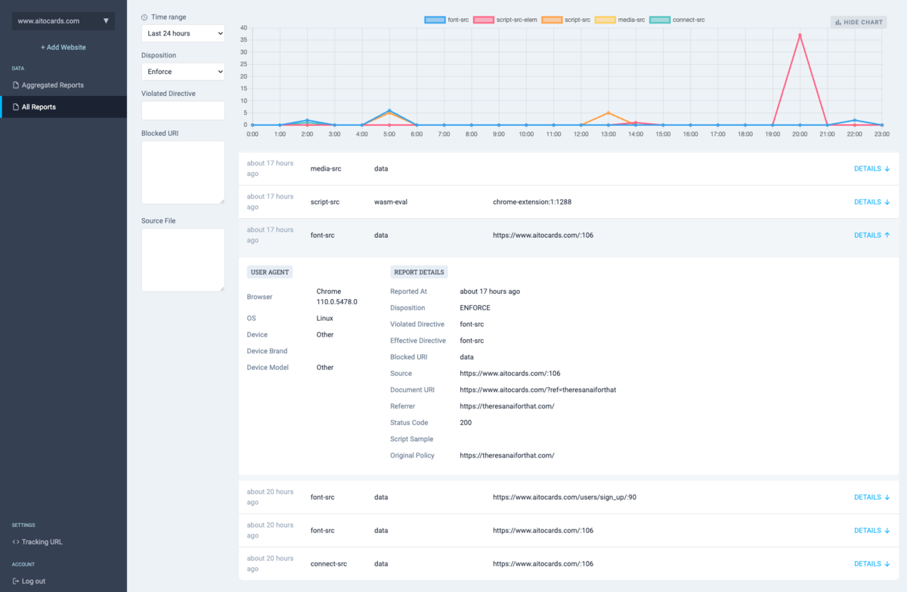

# CSP Hero

CSP Hero is a **free**, **open-source** server and dashboard designed to help developers collect and analyze [Content Security Policy (CSP)](https://developer.mozilla.org/en-US/docs/Web/HTTP/Guides/CSP) reports.

> The easiest way to try CSP Hero is in [our cloud service](https://www.csphero.com/).



---

## Features

- **Collect CSP reports**: collect CSP violation reports from your web applications.
- **Analyze reports**: View and analyze collected reports in a user-friendly dashboard.
- **Report aggregation**: Smartly aggregate reports to get a comprehensive view.

## Quick start with Docker

A public docker image is available on [Docker Hub](https://hub.docker.com/r/hiquest/csphero).

Have a look at the [docker-compose example](docker-compose.yml) to quickly start CSP Hero with Docker.

```bash
docker compose up -d
```

Make sure to set the `SECRET_KEY_BASE` environment variable to a secure random value, as it is used to sign session cookies.

Also, since we need a postgresql database, you need to set the `DB_HOST`, `DB_PORT`, `DB_USER`, `DB_PASSWORD`, and `DB_NAME` environment variables to connect to your database.

## What is a Content Security Police?

[Content Security Policy](https://developer.mozilla.org/en-US/docs/Web/HTTP/Guides/CSP) allows developers to define which resources are allowed to load on their web pages, helping to prevent cross-site scripting (XSS) attacks and other vulnerabilities.

When a violation occurs, the browser sends a report to the provided endpoint (via [report-uri](https://developer.mozilla.org/en-US/docs/Web/HTTP/Reference/Headers/Content-Security-Policy/report-uri) or [report-to](https://developer.mozilla.org/en-US/docs/Web/HTTP/Reference/Headers/Content-Security-Policy/report-to) directive), which can be collected and analyzed.

CSP Hero provides an endpoint to collect these reports and a dashboard to analyze and visualize them.

## Extra tools

Several free tools are available online (soon to be open-sourced):

- [CSP Builder](https://www.csphero.com/csp-builder) allows you to create a CSP policy with a user-friendly interface.
- [CSP Validator](https://www.csphero.com/csp-validator) validates your CSP policy and suggests improvements.
